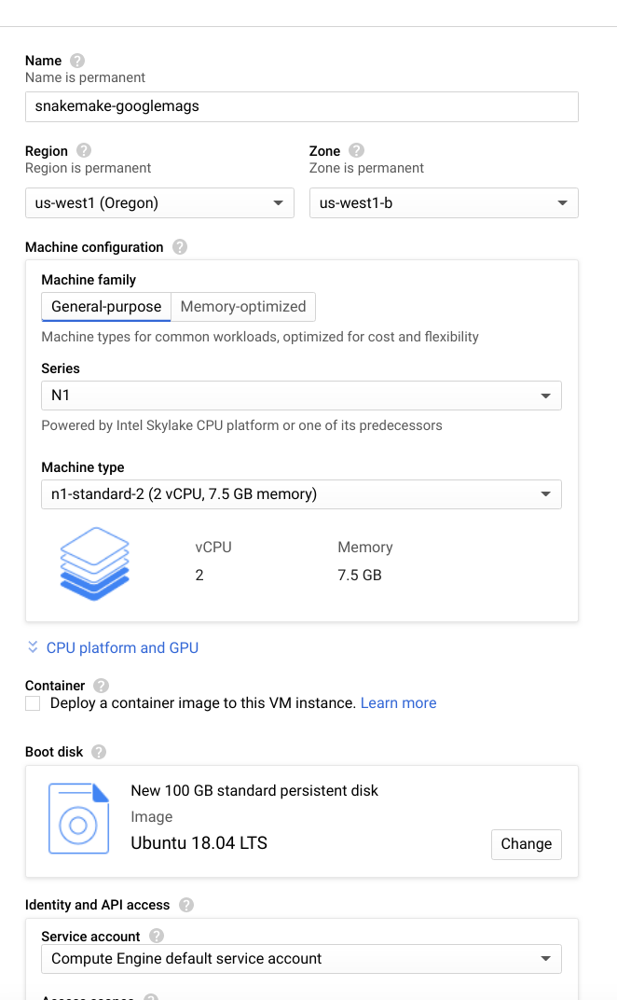

# GoogleMAGs

This tutorial is intended to run on Google Cloud, specifically by starting
a Google Compute Engine Instance, shelling in, installing snakemake,
and running a pipeline. Full instructions are included here.


## 1. Create an Instance

You will want to first log in to your project and [create an instance](https://console.cloud.google.com/compute/instances).
If you don't have any instances, this coincides with clicking "Create":


Specifically, these are the choices that are recommended:

 - **Region** you want to be as close to where your main operations are as possible. For California, this typically means us-west1, and then choose a,b, or c. The actual instances for a/b/c vary by project, so your choice of A isn't equal to another project's, so don't worry too much about your choice.
 - **Machine Family** I typically choose General purpose, because we just need a basic linux base.
 - You don't need to select that we are deploying a container to the instance.
 - **Machine Type** It's best to choose a smaller (but not too small) size, typically I choose n1-standard-2 (2 vCPUs, 7.5 GB memory).
 - **Boot Disk** Even for development, you always want to chose an image with long term support. E.g., for now I would choose Ubuntu 18.04 LTS (long term support). There is a minimal image that works well too. For the actual disk size, I tend to choose a larger one to be safe (100GB).
 - **API Access** you generally want to limit to only those endpoints that are needed, but if you are developing it's easier to grant access to all APIs. For this example, we would want access to Google Compute Engine, Google Life Sciences, and Google Storage.
 - I typically allow both http/https traffic in the case that I need it.



You don't need to enable delete protection, or to ask for a static (not ephemeral) ip address under networking. This is just a test instance and it will go away rather quickly. When you are happy with your setup, click on "Create" at the bottom.


A note that I like to share is that you can click on "equivalent rest or command line" directly below this button.
If you might want to create this programatically in the future, click there.

## 2. Shell Inside

After you create the instance, it will take a brief time to spin up, and when it's ready,
a small green dot will appear on the left side.


You can then click on the "SSH" dropdown on the right side, and I like to copy
paste the command for shelling into the instance from my command line (view gcloud commnd).
If you haven't yet installed gcloud, see [these instructions](https://cloud.google.com/sdk/install).


## 3. Install dependencies

Now let's install dependencies! This means snakemake, and also downloading the
pipeline files. 

### Host Dependencies

First, here is for snakemake.

```bash
sudo apt-get update
sudo apt-get install -y git gcc python3-dev
```

Ensure that python 3 is installed

```bash
$ which python3
/usr/bin/python3
$ python3 --version
Python 3.6.9
```

Let's also install pip.

```bash
wget https://bootstrap.pypa.io/get-pip.py
chmod +x get-pip.py
sudo python3 get-pip.py
```

### Snakemake

If you like, you can use a virtual environment, however since this is a one-off
testing instance I'm going to install snakemake using the system python.

```bash
git clone -b add/google-cloud-pipelines https://github.com/vsoch/snakemake
cd snakemake
sudo python3 setup.py install
```

You could also use pip if you prefer!

```bash
sudo -H pip install .
```

And ensure it installed successfully and snakemake is on your path.

```bash
$ which snakemake
/usr/local/bin/snakemake
```

### Google API Python Clients

Google always suggests that you upgrade your python clients, so let's do that.
Also, these aren't provided by default with Snakemake (there are many users that want
to use Snakemake in a context outside of Google). However, we need them.

```bash
sudo -H pip3 install --upgrade google-api-python-client
sudo -H pip3 install --upgrade google-cloud-storage
sudo -H pip3 install oauth2client
```

If you haven't yet, create a Google Storage Bucket in the interface.
You'll want to be sure to add pipelines service accounts to your Storage bucket users.
This step is hairy and error prone and I never really get it right the first time.

### GoogleMAGs

Let's clone the repository for Google MAGS.

```bash
cd $HOME
git clone https://github.com/WatsonLab/GoogleMAGs
cd GoogleMAGs
```

Snakemake requires GOOGLE_APPLICATION_CREDENTIALS, and since you might want to
run this is (non Google places) too, you should [download your service account](https://console.cloud.google.com/iam-admin/iam)
key and export it to the environment. From your host, you can copy to the instance as follows:

```bash
gcloud compute scp credentials.json [username]@snakemake-googlemags:/home/[username]/credentials.json
```

And note that your computer username might not correspond to your gcloud username (in the above I use the same variable).
Then you can export your credentials to the environment.

```bash
export GOOGLE_APPLICATION_CREDENTIALS="/home/[username]/credentials.json"
```

## 4. Run Snakemake

Now let's test running Snakemake! Here we are in the root folder of the GoogleMAGs repository.
The snakefile we are targeting is `Snakefilev14` and we are going to choose the same region that our
instance is in.

```bash
snakemake  --google-lifesciences --verbose -s Snakefilev14 -j 400 --default-remote-prefix snakemake-testing/pig5 --use-conda --google-lifesciences-keep-cache --google-lifesciences-region us-west1-b
```

```bash
snakemake  --google-lifesciences --verbose  -s Snakefilev13 --default-remote-provider GS  --default-remote-prefix hn-snakemake/pig5 --use-conda
```

**under development**


